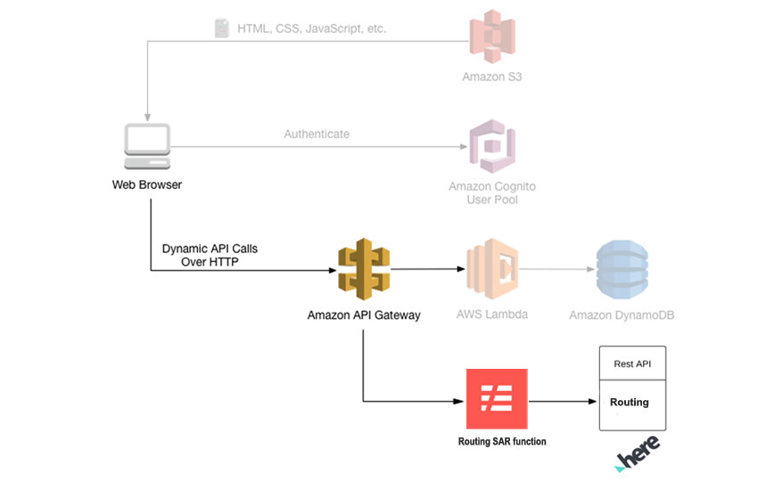
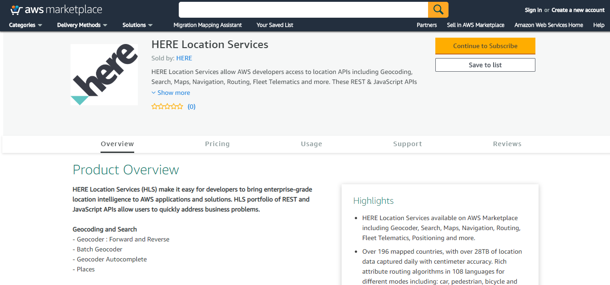
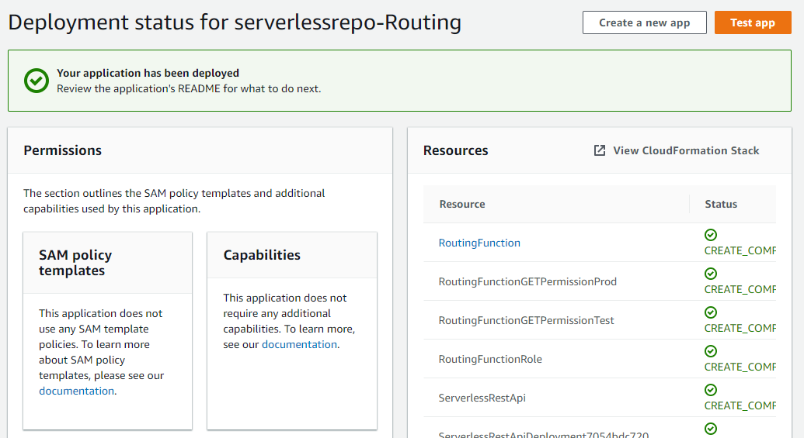
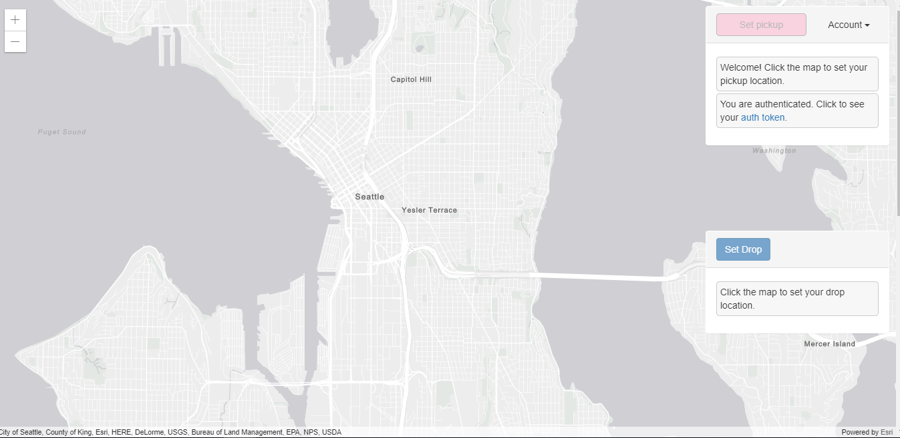
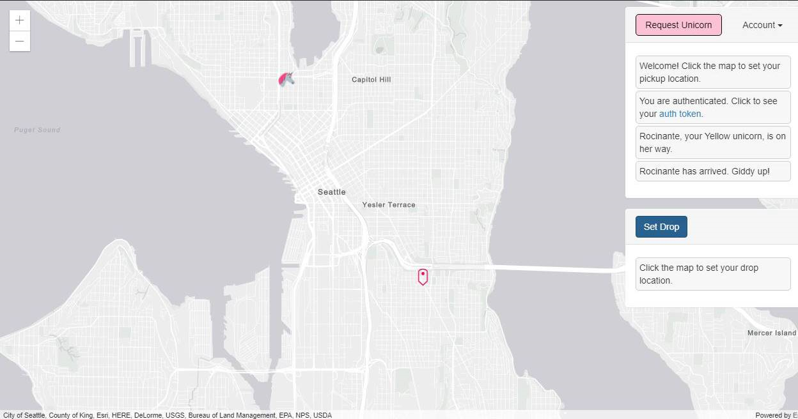
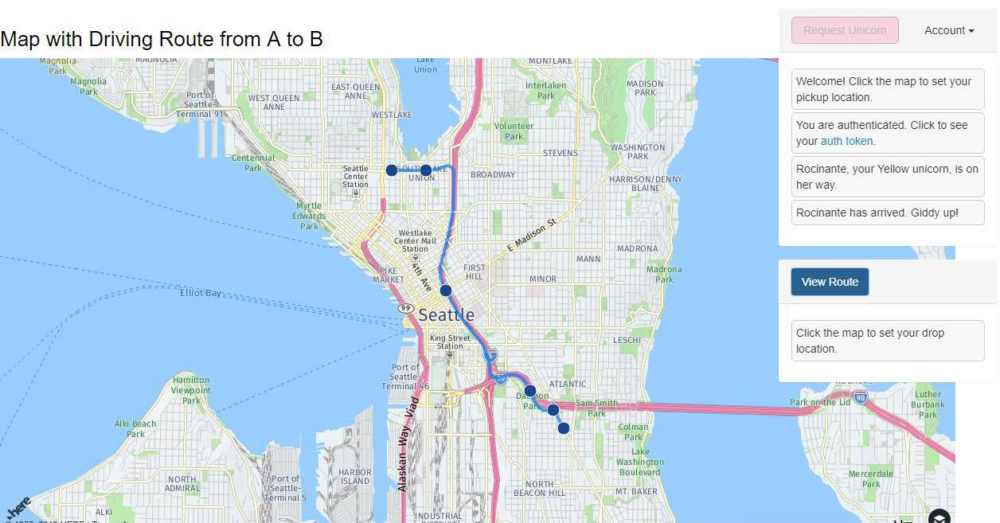

# Module 5: Location Services with AWS Lambda for Web Applications

In this module you are going to learn about extending your web applications with serverless applications from the AWS Serverless Application Repository (SAR).

## Architecture Overview

After completion of previous modules, you were able to select the pickup location of a Unicorn. In this module we are going to add the drop location for the Unicorn and draw the Route map (Directions) from pickup location to drop location of the Unicorn. For this , we are using HERE Routing Serverless function which is available on the AWS SAR.
In this module you will learn about how to deploy and use AWS SAR Functions (we will be using HERE Routing function) and how to use the location services of HERE. 

The diagram above shows how the SAR function is deployed and integrated with Amazon API Gateway component. This module integrates with the existing resources you have built in the previous modules. The greyed out items are pieces you have already implemented in previous modules.
The static website you deployed in the first module already has a page configured to interact with the API you'll build in this module. The page at /ride.html has a simple map-based interface for requesting a unicorn ride. After authenticating using the /signin.html page, you will be able to select your pickup location by clicking a point on the map and then requesting a ride by choosing the "Request Unicorn" button in the upper right corner. After that you will get the option to set a drop location. Once you select the drop location you will get the button called view route. Using view route button, you will be able to see the route between pickup and drop point on the Map.

This module will focus on the steps required to deploy the SAR function and integrate with previous modules, but if you're interested in how the browser code works that calls this API, you can inspect the ride.js file of the website. In this case the application uses jQuery's ajax() method to make the remote request.

<strong>Note:</strong> HERE Location Suite provides access to mapping, geocoding, places, routing, traffic, transit, positioning, and geo-visualization functionality and out-of-the-box solutions to solve complex location problems such as geofencing, calculating the toll costs for a route, and customizing a route. To learn more in details use the below links. 

[Rest API](https://saas.awsmarketplace.here.com/rest-api)

[JavaScript API](https://saas.awsmarketplace.here.com/javascript-api)

### 1. Deploy HERE Routing Function

In this step you are going to deploy HERE Routing function in AWS console. Use this link to deploy 

https://serverlessrepo.aws.amazon.com/applications/arn:aws:serverlessrepo:us-east-1:760301537001:applications~Routing

<strong>Step-by-step instructions (expand for details)</strong>

1. Click on below URL link, it leads to AWS Routing SAR function.
     https://serverlessrepo.aws.amazon.com/applications/arn:aws:serverlessrepo:us-east-1:760301537001:applications~Routing
     
     

1. For deployment of this function you need to have HERE Account, so first sign up for HERE account.

1. Sign up for a free or paid plan on
     https://aws.amazon.com/marketplace/pp/B07JPLG9SR/?ref=_ptnr_aws_sar

     
     
1. Click the “Continue to Subscribe” button in the top-right corner of the page.

1. In the next page You can select the subscription type, by default the “Standard Tier” configuration has been selected. (You can do “Up to 250,000 Transactions per month” at free of cost) So you can leave the default selection and click on to “Click here to setup your account”

1. Provide your basic details and Register HERE account for Free.

1. After successful registration, it generates your app_id and app_code. You will get a response as “We are fetching your API credentials”. It may take few minutes to generate credentials

1. It will generate your app_id & app_code.

     

1. Save your HERE Location Services API app_id & app_code and deploy the function.

1. Go back to the function deployment page.

3. Find the “Deploy” button on the right corner of the page, click on “Deploy” button. It provides the environmental set up for the function.

4. On the next page, find the Application settings in the bottom right corner of the page.

     

5. Preferably use the Default Application name. 

6. Enter your HERE app_id and app_code which you have created in the step -1.

7. Click “Deploy” to deploy your function.

8. It may take few minutes of your time to create and deploy the function, once it’s deployed successfully you will get a message ‘Your application has been deployed’.

     

9. After success message click on Test app, it will open your Lambda function which you have deployed.

1. Click on the API Gateway, to get an endpoint to access your function.

1. Note down the complete API endpoint to configure with your bucket.

     

### 2. Upload content to your Website Bucket

To view the changes on your website, you need to upload the content to your S3 Bucket with new and modified files. You need to add  functions and API endpoints to invoke the Routing function. 

<strong>Step-by-step instructions (expand for details)</strong>

1. Go to AWS Management Console.

1. In the AWS Management Console choose Services then select S3 under Storage.

1. Select your bucket which you have created and used in the previous modules.

1. Click the below link and download the zip file (website_files.zip) and extract on your local machine.

     https://github.com/heremaps/devrel-workshops/aws-serverless/web-application/website_files.zip
     
2. Browse to the directory where you saved the files locally which you have downloaded in previous step. Open the file **“ride.js”** with any text editor. 

3. Find the function **“handleviewroute”** in ride.js code, In ajax URL enter/paste the API endpoint which you have noted in step-2.

     

1. Save the file.

1. Go back to AWS console -> S3 Bucket Page, Choose Upload, then Add Files in S3 bucket.

1. Browse to the directory where you saved your locally drag & drop all folder and file or select file, and choose Open individually.

     **(Note: js files inside the js folder & css file inside the css folder)**
     
     
     
     **File List:**
     
     HTML file:
     ride.html – modified,
     
     CSS folder:
     route.css – new file,
     
     JS folder:
     ride.js – modified, map.js – new file

## Implementation Validation

After completing all the above implementation steps you should be able to access your static website by visiting the website endpoint URL for your S3 bucket.

     
1. After completing the above 3 steps, you should be able to access your website by visiting the website endpoint URL for your S3 bucket.

1. Visit /ride.html under your website domain.

1. If you are redirected to the sign in page, sign in with the user you created in the previous module.

1. You should be able to see "set drop" button on the right-side corner.

     

1. After the map has loaded, click anywhere on the map to set a pickup location. 

1. Choose Request Unicorn. You should see a notification in the right sidebar that a unicorn is on its way and then see a unicorn icon fly to your pickup location.

1. After the Unicorn has arrived, select the drop point in the map and click the Set Drop button on the right-side page corner.

1. Now it should automatically load the map and show the route map from your Pickup point to Drop point.

     
     
     

1. Congratulations, you have completed the **Location Services with AWS Lambda for Web Applications module!**.

For further documentation please see the below links:
     
   https://saas.awsmarketplace.here.com/rest-api 
     
   https://saas.awsmarketplace.here.com/javascript-api

