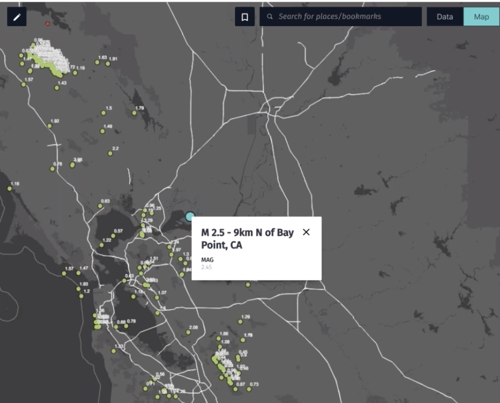
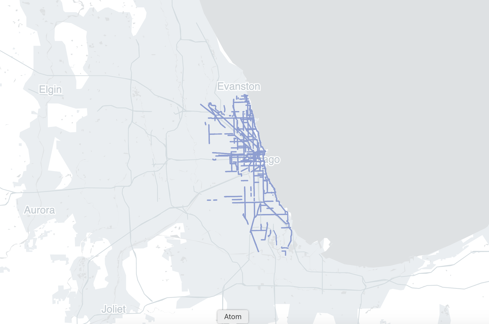

# Creating Interactive Maps in the Cloud

Diving into large open data sets, this workshop will introduce techniques and
tools for interactive filtering and visualization of geo data. This session is
geared towards those with basic experience in web development.

[Workshop Pass Registration](https://ti.to/foss4g-na-2019/foss4g-na-2019-san-diego/with/fawgwk87gpu)

During the workshop, attendees will be issued a challenge to utilize the new
XYZ data management service.

The submission with the most creative challenge
submission will win 1 of 3 new Super NES Classic gaming systems.

Be sure to join our slack space to ask any questions: [t.her.is/Slack](t.her.is/Slack)

We'll be monitoring the channel called #xyz.

# Overview

- Introduction to HERE XYZ
- XYZ Studio Overview
- Activity: Make a Map with XYZ Studio
- XYZ CLI Overview
- Activity: Upload data with the CLI
- Interactive Web Maps with XYZ & Tangram
- Activity: Make a Tangram Map
- QGIS Plugin
- XYZ APIs and HERE Location Services

# Topics

## XYZ Studio

*60min*

__Demonstration__

- upload GeoJSON data to HERE XYZ
- style a map, including conditionally based on properties
- publish a map for others to view

__Activity__

Once the demo is complete, we encourage you, on your own, to complete this beginner activity:

1. Visit [XYZ Studio](https://xyz.here.com) to create and account
2. Download the data sources (listed below)
3. Upload to studio
4. Customize your map
5. Create a map bookmark
6. Share the map and send to your parents!



__Data Sources:__

- [Seismic Activity](https://earthquake.usgs.gov/earthquakes/feed/v1.0/geojson.php)
- [Volcanoes of the World](https://earthworks.stanford.edu/catalog/harvard-glb-volc)

__Resources for more help:__

- [Mapping Seismic Activity Tutorial](https://codelabs.here.xyz/tutorial/05-Mapping-Seismic-Activity#0)
- [Mapping Seismic Activity Livestream](https://www.twitch.tv/videos/408122281)
- [Mapping Seismic Activity Webinar](https://youtu.be/KUwLu1Wnlis)

## HERE XYZ CLI

*30min*

__Demonstration__

1. Install HERE CLI
```
npm install -g @here/cli
```
2. Configure CLI with your account
```
here configure account
```
3. Create an XYZ Space
```
here xyz create -t "my new space"
```
4. Upload data
```
here xyz upload SPACE-ID -f FILE-NAME
```
5. View with GeoJSON viewer to understand shape of data
```
here xyz show SPACE-ID -w
```
6. View with Space Invader to inspect properties in depth.
```
here xyz show SPACE-ID -v
```
7. Use [mapshaper](https://mapshaper.org/) to convert planes and simplify polygons

8. Upload with CLI
9. Upload CSV with unusual lat/lon fields. (streetlights data)

__Activity__

- [ ] upload a shapefile (tectonic plates) with the CLI
- [ ] add that space to the earthquake map in Studio
- [ ] add tags during upload

__Data sources__

- [San Diego Streetlights CSV](streetlights.csv)
- [SF Lands shapefile](sflnds_current.zip)
- [Tectonic plates GeoJSON](https://github.com/fraxen/tectonicplates/tree/master/GeoJSON)

__Resources__
- [HERE CLI Documentation](https://www.here.xyz/cli/)

## Interactive Web Maps

*45 min*

__Demonstration__
1. Create the boilerplate code for a Tangram map by entering this into your command-line
```
npx tangram-make {directory name} {space id} {xyz token}
```
`{directory name}` is the name of the new directory that will be created. `{space id}` is the ID of the XYZ Space of the data you will show. `{xyz token}` is your XYZ access token.
2. Enter into the new directory with `cd {directory name}`
3. Start a local server to view the map
```
python -m SimpleHTTPServer 8888
```



__Activity__

- [ ] Run `tangram-make` to create the boilerplate code for a Tangram map
- [ ] Show data from XYZ Space on your map
- [ ] Publish to Github pages in order to potentially win a gaming system.


__Resources__

- [Tangram documentation](https://tangrams.readthedocs.io/en/latest/)
- [Tangram and XYZ Space examples](https://github.com/heremaps/xyz-showcase)
- [XYZ Hub APIs documentation](https://www.here.xyz/api/)
-


## QGIS plugin

- [Install QGIS](https://qgis.org/en/site/forusers/download.html) 
- QGIS XYZ plugin from Plugin Directory
- enter your token
- pick your space
- do some QGIS things
- upload data back to XYZ


## HERE XYZ APIs and HERE Location Services

*30 mins*

- routing
- geocoding

Advanced Activity:
